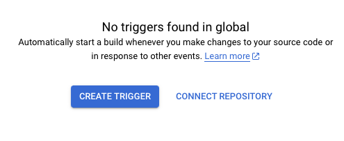
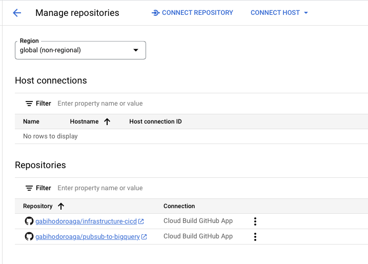

# infrastructure-cicd

This repo is a boilerplate and seed for how to setup infrastructure as a code and a cd/cd pipeline in GCP using Terraform and Cloud build.

## Setup

Setup you variables

```bash
PROJECT_STG=blog-infra-staging-1
PROJECT_PROD=blog-infra-production-1
```

Create the 2 projects

```bash
gcloud projects create $PROJECT_STG --name="Staging"
gcloud projects create $PROJECT_PROD --name="Production"
```

Create the 2 buckets used for maintaining the terraform state

```bash
gcloud storage buckets create "gs://$PROJECT_STG-tfstate"
gcloud storage buckets create "gs://$PROJECT_PROD-tfstate"
```

Fork the repositories.

- [gabihodoroaga/infrastructure-cicd](https://github.com/gabihodoroaga/infrastructure-cicd.git)
- [gabihodoroaga/pubsub-to-bigquery](https://github.com/gabihodoroaga/pubsub-to-bigquery.git)

Path the `infrastructure-cicd` project in order to match you environment.

These are the files and properties that need to be updated:

- **environments/production/backend.tf** - update the bucket property to match your production bucket name
- **environments/production/main.tf** - update the project property to match you production project name
- **environments/staging/backend.tf** - update the bucket property to match your staging bucket name
- **environments/staging/main.tf** - update the project property to match you staging project name

Push you changes.

Login to your [GCP Console](https://console.cloud.google.com) and enable billing.
Check the official documentation https://cloud.google.com/billing/docs/how-to/modify-project if you have to.

Then go to Cloud Build, enable the api and connect the 2 repositories. You have to do it for both projects: production and staging.

Cloud Build -> Triggers -> Connect Repository



Do not use the "repositories (2nd gen)" option because is still in preview and I don't know how it works.

If you did this process correctly you should find the 2 repositories in you "Manage repositories" like in the 
picture bellow



Next we need to create the build trigger for infra for each of the projects. 

Staging, but first set you repo owner name

```
REPO_OWNER=[your_github_user]
```

```bash
gcloud beta builds triggers create github \
    --region=global \
    --repo-name=infrastructure-cicd \
    --repo-owner=$REPO_OWNER \
    --branch-pattern='^main$' \
    --build-config=cloudbuild-staging.yaml \
    --project $PROJECT_STG
```

and then production

```bash
gcloud beta builds triggers create github \
    --region=global \
    --repo-name=infrastructure-cicd \
    --repo-owner=$REPO_OWNER \
    --branch-pattern='^production$' \
    --build-config=cloudbuild-production.yaml \
    --require-approval
    --project $PROJECT_PROD
```

## License

This project is licensed under the terms of the MIT license.
